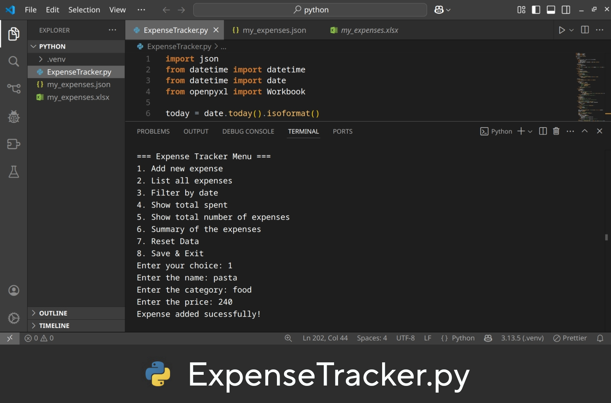
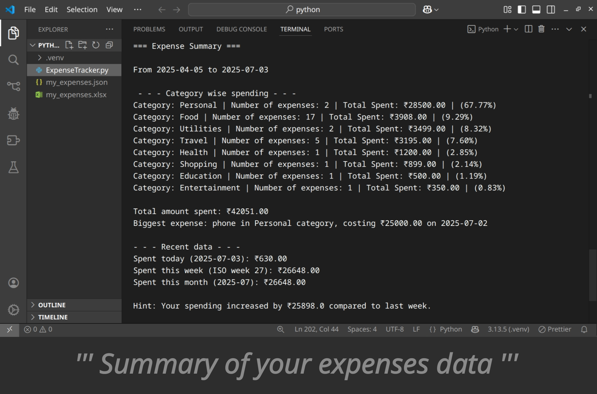
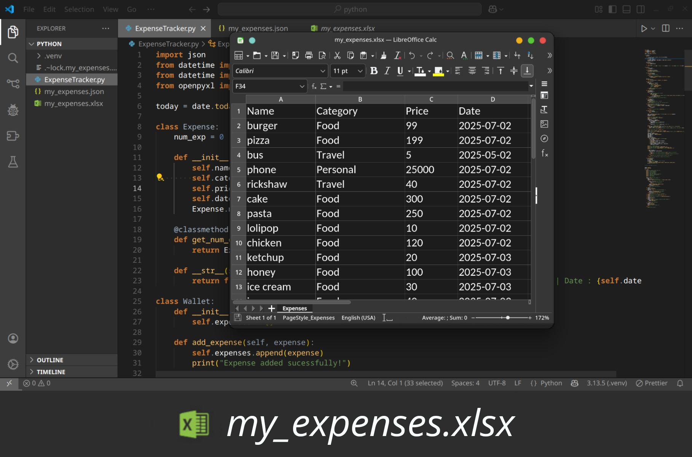
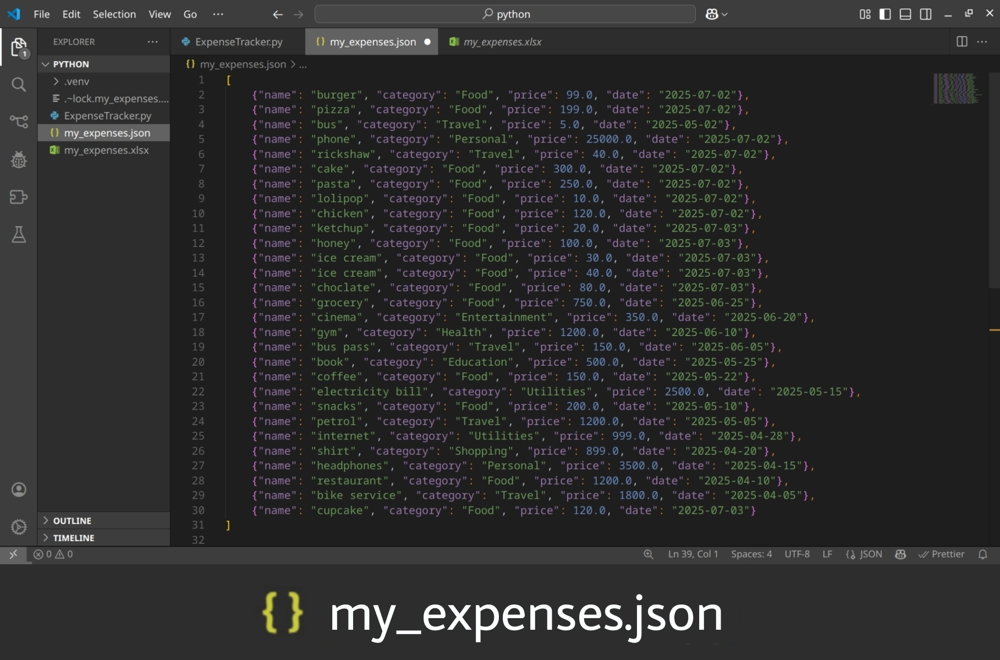

# Expense Tracker 💵🫰🏽

A simple command-line **Expense Tracker** I built using **Python** to **log**, **categorize**, and **analyze** your late night cravings...
It saves your expenses in **JSON**, exports to **Excel**, and provides clear summaries with trends to help you manage your money better.

---

## ! Features

* Add expenses with **name**, **category**, **price**, and **date**
* View all expenses and even filter by date 😯
* Automatic category standardization stuff so(no duplicate “food” vs “Food” bs)
* **Detailed summary** : category breakdown, biggest expense, daily/weekly/monthly spending, and trend hints 💅🏻
* Export your data to an `.xlsx` file
* Fully offline and simple to run

---

## ! Demo

Here’s what to expect:


*Main Menu showing overview of the tasks performed by the program*


*A full fledge summary of all your expenses, showing.. 
1. Category wise spending
2. Total amount spent
3. Your biggest expense
4. Recent expense data overview (Day/Week/Month)
5. Trend hints *


*Expenses data stored in Excel sheet autonatically*


*Data is handled in the json file*

---

## ? Under the Hood

**Uses**
* **Python 3**
* `json` (built-in) for storing data
* `openpyxl` for Excel export
* 🤓

---

## ? Project Structure

```
Expense-Tracker/
 ├── my_expenses.json   # Your saved expenses
 ├── my_expenses.xlsx   # Auto-generated Excel file
 ├── expense_tracker.py # Main Python script
 ├── README.md          # Project description & instructions(this file lmao)
```

---

## ? How to Run

1️ **Clone the repo:**

```bash
git clone https://github.com/KartikHalkunde/Expense-Tracker.git
cd Expense-Tracker
```

2️ **Install dependencies:**

```bash
pip install openpyxl
```
yeah thats it.


3️ **Run the tracker:**

```bash
python expense_tracker.py
```

---

##  Example

```
=== Expense Tracker Menu ===
1. Add new expense
2. List all expenses
3. Filter by date
4. Show total spent
5. Show total number of expenses
6. Summary of the expenses
7. Reset Data
8. Save & Exit
```

---

## ? Why I Made This

To track why am i getting so broke, and also as to practice **Python OOP**, file handling, and stuff as a cs major🤓.

---

## ! Upcomming Improvements (Maybe/maybe not)

* Pie charts 
* Bar graphs for dramatic effect
* CLI arguments
* Maybe a web version (but that costs money so…)
---

## Contributing

Pull requests are welcome! 

---

## 📜 License

**MIT License** — Do whatever you want.
